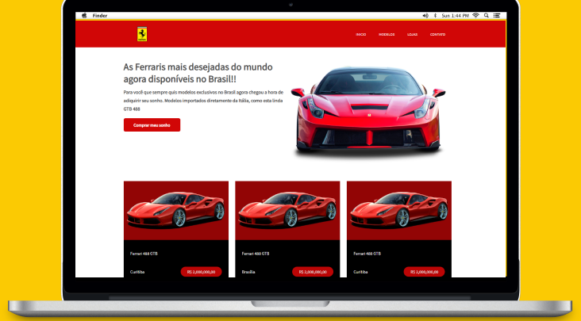

# Responsividade e SASS
Projeto bem simples feito com o intuito de por prática conhecimentos de
responsividade e aprender Sass 
## Tecnologias 💻
<ul>
<li>
HTML
</li>
<li>
CSS
</li>
<li>
SASS
</li>
<li>
Javascript
</li>
</ul>

## Preview

 

